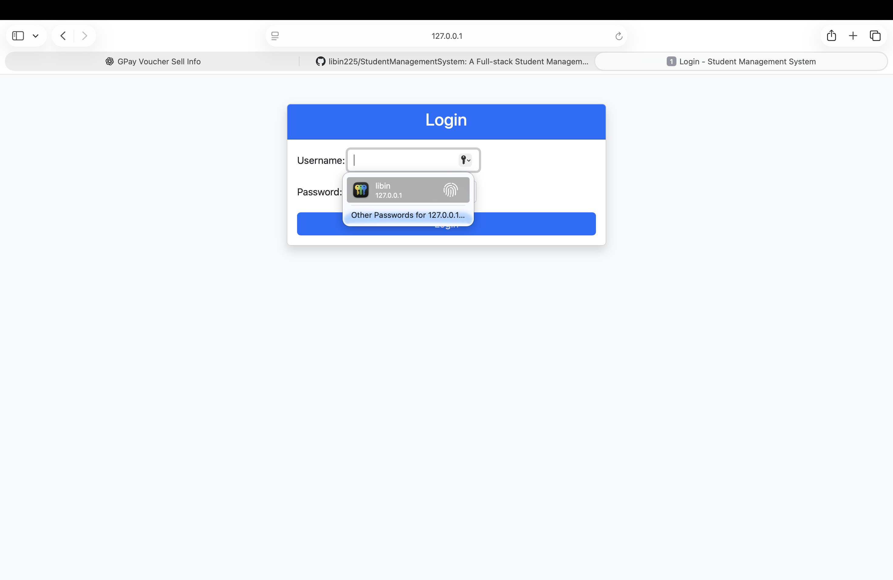
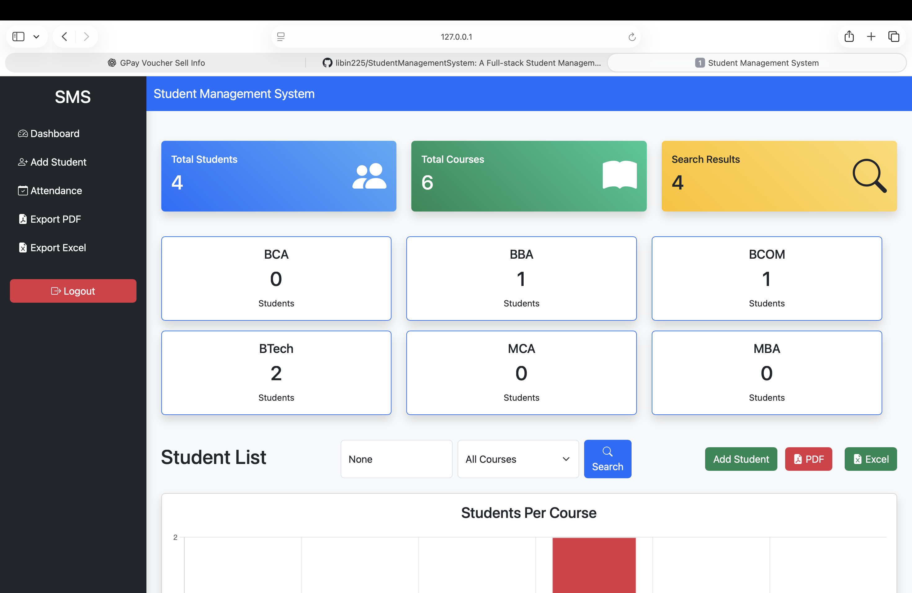
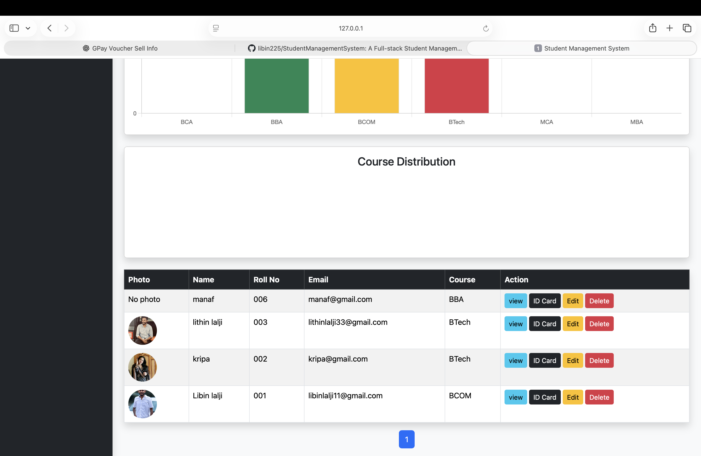
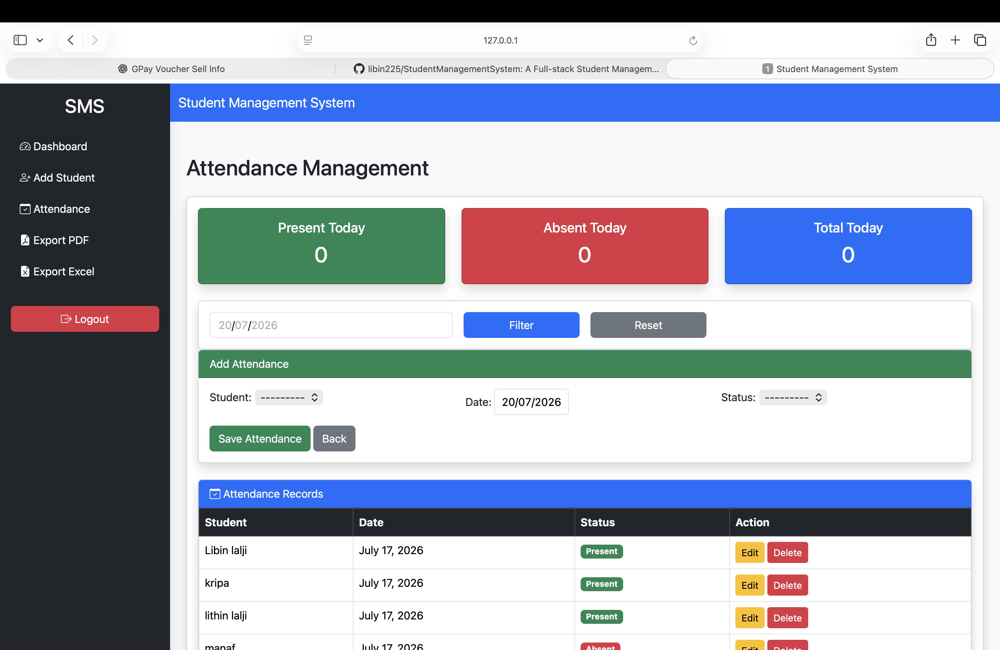
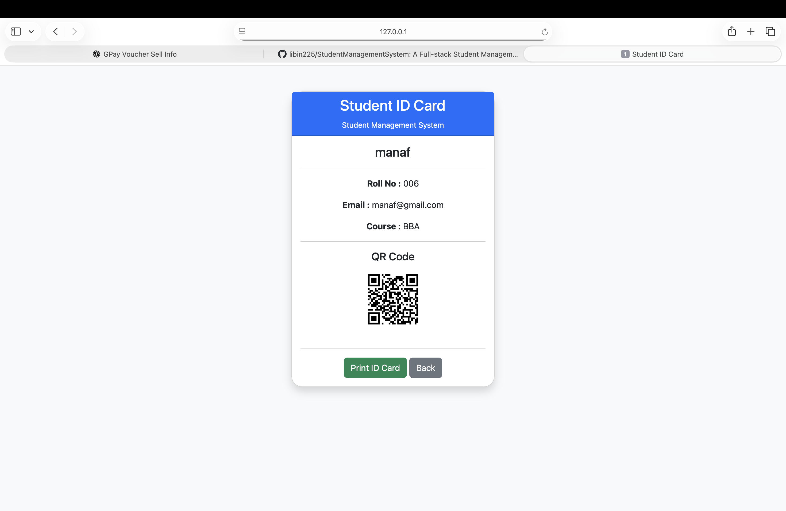

# 🎓 Student Management System

A full-stack **Student Management System** built using **Python Django** to manage student records, attendance, courses, and reports. This application provides an easy-to-use interface for administrators to perform daily student management tasks efficiently.

---

## 🚀 Features

* 🔐 User Authentication (Login & Logout)
* 👨‍🎓 Student Management (Add, Edit, Delete)
* 📚 Course Management
* 📅 Attendance Management
* 🔍 Student Search & Filter
* 📄 Export Student Records to PDF
* 📊 Export Student Records to Excel
* 🆔 Student ID Card with QR Code
* 📈 Dashboard Statistics
* 📃 Pagination
* 💬 Success/Error Messages
* 📱 Responsive Bootstrap UI

---

## 🛠️ Technologies Used

* Python
* Django
* SQLite3
* HTML5
* CSS3
* Bootstrap 5
* JavaScript
* ReportLab
* OpenPyXL
* QRCode

---

## 📂 Project Structure

```
StudentManagementSystem/
│── manage.py
│── requirements.txt
│── smsproject/
│── studentapp/
```

---

## ⚙️ Installation

```bash
git clone https://github.com/libin225/StudentManagementSystem.git

cd StudentManagementSystem

pip install -r requirements.txt

python manage.py migrate

python manage.py createsuperuser

python manage.py runserver
```

---

## 🌟 Future Improvements

* Fee Management
* Student Marks Management
* Email Notifications
* REST API
* Docker Deployment
* Cloud Deployment

---

## 📸 Screenshots

### Login Page


### Dashboard


### Student Details


### Attendance


### Student ID Card


---

## 👨‍💻 Author

**Libin Lalji**

GitHub: https://github.com/libin225
